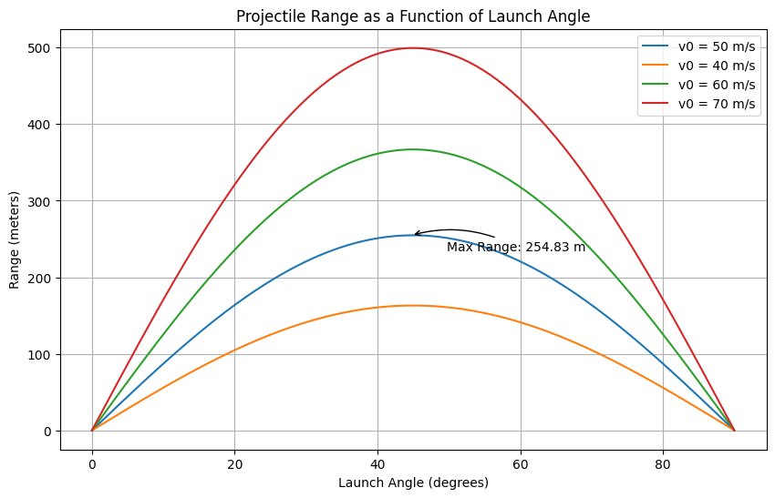

Below is a detailed exploration of the problem, organized into clear sections that address each of the tasks.

---

### 1. Theoretical Foundation

**Derivation of the Equations of Motion:**

For a projectile launched with an initial velocity  $v_0$ at an angle  $theta$ from the horizontal, we decompose the motion into horizontal and vertical components:

- **Horizontal motion:**
  $$
  v_{x} = v_0 \cos \theta, \quad x(t) = v_0 \cos \theta \, t
  $$
  (Since there is no horizontal acceleration in the ideal case, neglecting air resistance.)

- **Vertical motion:**
  
  $$ v_{y} = v_0 \sin \theta, \quad y(t) = v_0 \sin \theta \, t - \frac{1}{2} g t^2$$
  
  where $$ g $$ is the acceleration due to gravity.

**Solving the Differential Equation:**

The vertical motion equation is derived from the second-order differential equation:

$$
\frac{d^2 y}{dt^2} = -g.
$$

Integrating once gives the vertical velocity:

$$
\frac{dy}{dt} = v_0 \sin \theta - g t,
$$

and integrating again yields the vertical displacement:

$$
y(t) = v_0 \sin \theta \, t - \frac{1}{2} g t^2 + y_0.
$$

For a launch from ground level, $$ y_0 = 0 $$.

**Family of Solutions:**

The equations show that the trajectory depends on:
- The initial velocity $ v_0 $
- The launch angle $ \theta $
- The gravitational acceleration $ g $

Changing any of these parameters alters the solution’s shape and range, leading to a family of trajectories.

---

### 2. Analysis of the Range

**Determining the Range:**

For a projectile launched from the ground, the range $ R $ is the horizontal distance traveled when the projectile returns to $ y = 0 $ (other than the trivial solution $ t = 0 $. Setting $ y(t) = 0 $:
$$
v_0 \sin \theta \, t - \frac{1}{2} g t^2 = 0,
$$
which factors as:
$$
t \left(v_0 \sin \theta - \frac{1}{2} g t\right) = 0.
$$
Ignoring $ t = 0 $, the time of flight is:
$$
t = \frac{2 v_0 \sin \theta}{g}.
$$

The range is then:
$$
R = x\left(\frac{2 v_0 \sin \theta}{g}\right) = v_0 \cos \theta \cdot \frac{2 v_0 \sin \theta}{g} = \frac{v_0^2 \sin 2\theta}{g}.
$$

**Dependence on the Angle of Projection:**

 The term $\sin 2\theta$ implies that $ R $ reaches its maximum when $ 2\theta = 90^\circ$ or $ \theta = 45^\circ$

- For angles less than or greater than $45^\circ$, the range decreases.
- For angles less than or greater than $ 45^\circ $, the range decreases.

**Influence of Other Parameters:**

- **Initial Velocity $ v_0 $**: The range increases quadratically with $v_0$ since $R \propto v_0^2$.
- **Gravitational Acceleration $ g $**: A larger $ g $ results in a smaller range, as $R \propto 1/g$

---

### 3. Practical Applications

Projectile motion is more than a textbook problem. By adjusting the model, you can describe various real-world scenarios:

- **Uneven Terrain**:  
  If the launch or landing height differs from the ground level, the time of flight and consequently the range must be recalculated. The vertical displacement equation becomes:
  $$
  y(t) = y_0 + v_0 \sin \theta \, t - \frac{1}{2} g t^2,
  $$
  and solving for $ t $ when $ y(t) $ equals the landing height introduces quadratic complexities.

- **Air Resistance**:  
  Incorporating drag forces (typically proportional to the velocity squared or linearly with velocity) complicates the motion equations and usually requires numerical methods for a solution. Air resistance shortens the range and alters the optimal launch angle.

- **Sporting Applications**:  
  In sports such as soccer or basketball, factors like spin, air resistance, and varying launch heights are crucial. Engineers and coaches use adapted models to optimize performance and training strategies.

- **Ballistics and Rocketry**:  
  In military and space applications, understanding projectile motion helps in targeting, trajectory optimization, and understanding the effects of atmospheric conditions.

---

### 4. Implementation

**Developing a Computational Simulation:**

A simple simulation tool can be developed in Python. Here’s an outline of how one might implement this:

1. **Define Parameters:**
   - Initial velocity $ v_0 $
   - Launch angle $ \theta $ (or a range of angles)
   - Gravitational acceleration $ g $
   - Optional: Launch height $ y_0 $

2. **Compute the Trajectory:**
   - For each $ \theta $ value, compute the time of flight and range using the derived equations.
   - For enhanced realism, include air resistance by solving the modified differential equations numerically (e.g., using the Runge–Kutta method).

3. **Visualization:**
   - Use matplotlib to plot the range $ R $ as a function of $ \theta $.
   - Plot trajectories for different initial conditions on the same graph to compare their behaviors.

**Sample Python Code:**

Below is a simplified code snippet that computes and plots the range as a function of the launch angle for a projectile launched from ground level without air resistance:

```python
import numpy as np
import matplotlib.pyplot as plt

# Parameters
v0 = 50  # initial velocity in m/s
g = 9.81  # gravitational acceleration in m/s^2
angles = np.linspace(0, 90, 180)  # angles from 0 to 90 degrees

# Compute range for each angle
ranges = (v0**2 * np.sin(np.deg2rad(2 * angles))) / g

# Plotting the results
plt.figure(figsize=(8, 5))
plt.plot(angles, ranges, label='Range vs. Angle')
plt.xlabel('Launch Angle (degrees)')
plt.ylabel('Range (meters)')
plt.title('Projectile Range as a Function of Launch Angle')
plt.legend()
plt.grid(True)
plt.show()
```



[problem 2 notes](https://colab.research.google.com/drive/1zzfWonRhVOmlJMqimYLAAzpdGPqIarxC?usp=sharing)

This code calculates the range for each angle and produces a clear plot. It demonstrates how the maximum range occurs at $ 45^\circ $ under ideal conditions.

---

### Conclusion

This analysis has provided:
- A derivation of the projectile motion equations from first principles.
- An explanation of how the range depends on the launch angle and other parameters.
- Insights into practical applications and adaptations of the model.
- A framework for computational simulation and visualization.

This comprehensive approach not only reinforces fundamental physics but also shows how these principles can be applied to solve real-world problems.