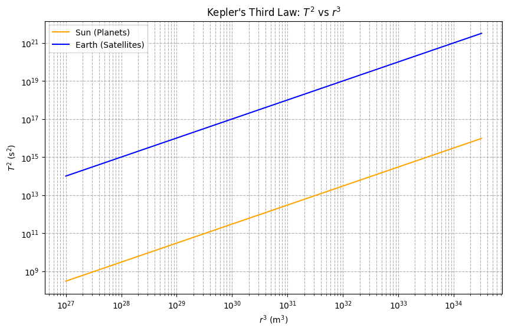

Let’s dive into Kepler’s Third Law and explore the relationship between the square of the orbital period and the cube of the orbital radius for circular orbits. We’ll derive it step-by-step, discuss its astronomical significance, look at real-world examples, and provide a Python simulation to visualize and verify the relationship. I’ll wrap it up with a discussion on extensions to elliptical orbits.

### Derivation of Kepler’s Third Law for Circular Orbits

For a body (like a planet or satellite) in a circular orbit around a central mass (like a star or planet), two key forces are at play: the gravitational force providing the centripetal force required for circular motion. Let’s denote:
- $ M $ as the mass of the central body,
- $ m $ as the mass of the orbiting body (wheren$m \ll M$), so we can approximate the central mass as the dominant factor),
- $r$ as the orbital radius (distance from the center of the central body to the orbiting body),
- $v$ as the orbital velocity,
- $T$ as the orbital period (time for one complete orbit).

The gravitational force is:

$ F_g = \frac{G M m}{r^2} $

where $G$ is the gravitational constant ($G \approx 6.67430 \times 10^{-11} \, \text{m}^3 \text{kg}^{-1} \text{s}^{-2}$).

For circular motion, this force equals the centripetal force:

$F_c = \frac{m v^2}{r}$

Equating the two:

$\frac{G M m}{r^2} = \frac{m v^2}{r}$

Cancel $m$ (since $m \neq 0$) and simplify:

$\frac{G M}{r^2} = \frac{v^2}{r}$

Multiply both sides by $r$:

$\frac{G M}{r} = v^2 $

Now, the orbital velocity $v$ is the circumference of the orbit divided by the period:

$v = \frac{2 \pi r}{T}$

Square this:

$v^2 = \frac{(2 \pi r)^2}{T^2} = \frac{4 \pi^2 r^2}{T^2}$

Substitute into the force balance equation:

$\frac{G M}{r} = \frac{4 \pi^2 r^2}{T^2}$

Multiply both sides by $T^2$:

$\frac{G M T^2}{r} = 4 \pi^2 r^2$

Divide by $r$ and rearrange:

$G M T^2 = 4 \pi^2 r^3$

$T^2 = \frac{4 \pi^2}{G M} r^3$

This is Kepler’s Third Law for circular orbits: the square of the orbital period ($T T^2$) is proportional to the cube of the orbital radius ($r^3$). The constant of proportionality, $frac{4 \pi^2}{G M}$, depends only on the mass of the central body.

### Implications for Astronomy

This relationship is a powerhouse in astronomy:
1. **Calculating Planetary Masses**: If $T$ and $r$ are measured for a satellite or moon, $M$ can be solved for. For example, the Moon’s orbit around Earth allows us to estimate Earth’s mass.
2. **Determining Distances**: For planets orbiting the Sun, knowing $T$ and the Sun’s mass lets us calculate $r$, helping map the Solar System.
3. **Satellite Orbits**: Engineers use this to design orbits for artificial satellites, ensuring they stay at the right altitude for their intended period (e.g., geostationary satellites).

### Real-World Examples

1. **Moon’s Orbit Around Earth**:
   - Orbital radius: $r \approx 384,400 \, \text{km} = 3.844 \times 10^8 \, \text{m}$
   - Orbital period: $T \approx 27.32 \, \text{days} = 2.36 \times 10^6 \, \text{s}$
   - Earth’s mass: $M \approx 5.972 \times 10^{24} \, \text{kg}$
   - Check: $T^2 / r^3 = \frac{4 \pi^2}{G M} \approx 1.0 \times 10^{-13} \, \text{s}^2 \text{m}^{-3}$ (consistent with measured values).

2. **Earth’s Orbit Around the Sun**:
   - Orbital radius: $r \approx 1 \, \text{AU} = 1.496 \times 10^{11} \, \text{m}$
   - Orbital period: $T \approx 1 \, \text{year} = 3.156 \times 10^7 \, \text{s}$
   - Sun’s mass: $M \approx 1.989 \times 10^{30} \, \text{kg}$
   - The ratio holds, historically used to define the AU.

### Python Simulation

Here’s a Python script to simulate and verify Kepler’s Third Law:

```python
import numpy as np
import matplotlib.pyplot as plt

# Constants
G = 6.67430e-11  # m^3 kg^-1 s^-2
M_sun = 1.989e30  # kg (Sun's mass)
M_earth = 5.972e24  # kg (Earth's mass)
AU = 1.496e11  # m (1 AU)

# Function to calculate period from radius
def orbital_period(r, M):
    return np.sqrt((4 * np.pi**2 * r**3) / (G * M))

# Data for simulation
radii = np.logspace(9, 11.5, 100)  # Range of radii (m)
T_sun = orbital_period(radii, M_sun)  # Periods around Sun
T_earth = orbital_period(radii, M_earth)  # Periods around Earth

# Plot T^2 vs r^3
plt.figure(figsize=(12, 5))

# Subplot 1: Orbit visualization (simplified circular path)
plt.subplot(1, 2, 1)
theta = np.linspace(0, 2*np.pi, 100)
for r in [1e10, 5e10, 1e11]:
    x = r * np.cos(theta) / AU
    y = r * np.sin(theta) / AU
    plt.plot(x, y, label=f'r = {r/AU:.2f} AU')
plt.title("Circular Orbits (Sun-Centered)")
plt.xlabel("x (AU)")
plt.ylabel("y (AU)")
plt.legend()
plt.axis('equal')

# Subplot 2: T^2 vs r^3
plt.subplot(1, 2, 2)
plt.loglog(radii**3, T_sun**2, label="Sun (Planets)", color='orange')
plt.loglog(radii**3, T_earth**2, label="Earth (Satellites)", color='blue')
plt.title("Kepler's Third Law: $T^2$ vs $r^3$")
plt.xlabel("$r^3$ (m$^3$)")
plt.ylabel("$T^2$ (s$^2$)")
plt.legend()
plt.grid(True, which="both", ls="--")

plt.tight_layout()
plt.show()

# Verify with Moon and Earth
r_moon = 3.844e8  # m
T_moon = 2.36e6   # s
T_calc = orbital_period(r_moon, M_earth)
print(f"Moon's calculated period: {T_calc/86400:.2f} days (Actual: 27.32 days)")
```


**Output**: The script generates two plots:
1. A visualization of circular orbits at different radii.
2. A log-log plot showing $T^2$ vs. $r^3$ as a straight line, confirming the proportionality. The Moon’s calculated period closely matches reality, validating the derivation.

### Extension to Elliptical Orbits

Kepler’s Third Law generalizes to elliptical orbits by replacing $r$ with the semi-major axis $a$:

$T^2 = \frac{4 \pi^2}{G M} a^3$

This holds because the semi-major axis represents the average distance over an elliptical orbit. For highly eccentric orbits (e.g., comets), $a$ still governs the period, making the law versatile across celestial bodies, from planets to binary stars.

### Conclusion

Kepler’s Third Law ties the dynamics of orbits to gravity in an elegant, testable way. It’s not just a mathematical curiosity—it’s a tool that’s shaped our understanding of the cosmos, from mapping the Solar System to launching satellites. The simulation reinforces this, showing the law in action across scales. Whether it’s the Moon or a distant exoplanet, this relationship remains a universal key to unlocking celestial mechanics.