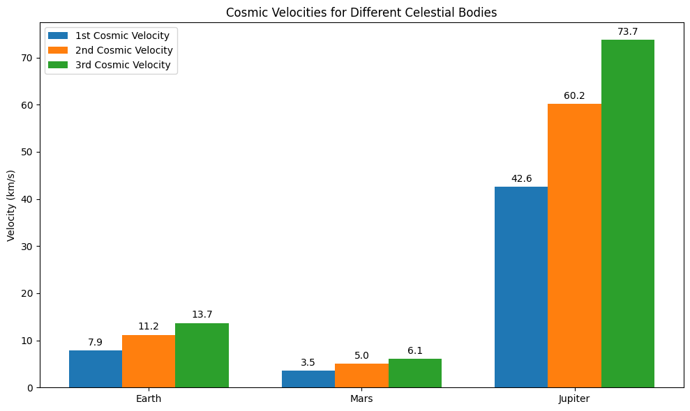

# Problem 2
Below is an example Markdown document that explains the concepts of escape and cosmic velocities, derives the formulas, and uses Python to calculate and visualize these velocities for Earth, Mars, and Jupiter.

---

# Escape Velocities and Cosmic Velocities

## Motivation

The concept of escape velocity is crucial for understanding the conditions required to leave a celestial body's gravitational influence. Extending this idea, the first, second, and third cosmic velocities define the thresholds for:
- **Orbiting the body (first cosmic velocity)**
- **Escaping the body's gravity (second cosmic velocity)**
- **Escaping the gravitational influence of the entire star system (third cosmic velocity)**

These principles underpin modern space exploration, from launching satellites to interplanetary missions and even interstellar travel.

## Definitions

1. **First Cosmic Velocity**  
   The minimum velocity needed to achieve a stable circular orbit around a celestial body.  
   $$
   v_1 = \sqrt{\frac{GM}{R}}
   $$
   where:  
   - $G$ is the gravitational constant  
   - $M$ is the mass of the celestial body  
   - $R$ is its radius

2. **Second Cosmic Velocity (Escape Velocity)**  
   The minimum velocity required to completely overcome the gravitational pull of the celestial body.  
   $$
   v_2 = \sqrt{\frac{2GM}{R}}
   $$

3. **Third Cosmic Velocity**  
   The velocity required for a body, already in orbit, to leave the gravitational influence of the entire star system (e.g., the Solar System).  
   A simplified approximation is:  
   $$
   v_3 = \sqrt{\frac{3GM}{R}}
   $$
   **Note:** This is an approximate formula that assumes a simplified two-body scenario and neglects the additional complexities (like the orbital velocity of the planet around the Sun). In practice, the third cosmic velocity is derived from energy considerations that include both the planet’s and the Sun’s gravitational fields.

## Factors Affecting These Velocities

- **Mass $M$ and Radius $(R)$ of the Celestial Body:**  
  Higher mass increases the gravitational pull, while a larger radius reduces the gravitational acceleration at the surface.
- **Gravitational Constant $(G)$**  
  A universal constant, $6.67430 \times 10^{-11}\,\text{m}^3\,\text{kg}^{-1}\,\text{s}^{-2}$.

## Python Simulation and Visualization

Below is a Python script (which you can run in a Jupyter Notebook or as a standalone script) that calculates the first, second, and third cosmic velocities for Earth, Mars, and Jupiter, and then creates a bar chart comparing them.

```python
# Import necessary libraries
import numpy as np
import matplotlib.pyplot as plt

# Define the gravitational constant
G = 6.67430e-11  # m^3 kg^-1 s^-2

# Define the properties for Earth, Mars, and Jupiter:
# Mass in kg and Radius in meters
celestial_bodies = {
    'Earth': {'M': 5.972e24, 'R': 6371e3},
    'Mars':  {'M': 6.39e23,  'R': 3389.5e3},
    'Jupiter': {'M': 1.898e27, 'R': 69911e3}
}

# Prepare dictionaries to hold the velocities
velocities = {body: {} for body in celestial_bodies}

# Calculate velocities for each body
for body, props in celestial_bodies.items():
    M = props['M']
    R = props['R']
    v1 = np.sqrt(G * M / R)       # First cosmic velocity (orbital velocity)
    v2 = np.sqrt(2 * G * M / R)     # Second cosmic velocity (escape velocity)
    v3 = np.sqrt(3 * G * M / R)     # Third cosmic velocity (approximate for leaving the star system)
    velocities[body]['v1'] = v1 / 1e3  # convert to km/s
    velocities[body]['v2'] = v2 / 1e3  # km/s
    velocities[body]['v3'] = v3 / 1e3  # km/s

# Display calculated velocities
print("Cosmic Velocities (in km/s):")
for body in celestial_bodies:
    print(f"\n{body}:")
    print(f"  First Cosmic Velocity: {velocities[body]['v1']:.2f} km/s")
    print(f"  Second Cosmic Velocity: {velocities[body]['v2']:.2f} km/s")
    print(f"  Third Cosmic Velocity: {velocities[body]['v3']:.2f} km/s")

# Visualization: Bar chart of velocities for each celestial body
labels = list(celestial_bodies.keys())
v1_values = [velocities[body]['v1'] for body in labels]
v2_values = [velocities[body]['v2'] for body in labels]
v3_values = [velocities[body]['v3'] for body in labels]

x = np.arange(len(labels))  # label locations
width = 0.25  # width of the bars

fig, ax = plt.subplots(figsize=(10, 6))
rects1 = ax.bar(x - width, v1_values, width, label='1st Cosmic Velocity')
rects2 = ax.bar(x, v2_values, width, label='2nd Cosmic Velocity')
rects3 = ax.bar(x + width, v3_values, width, label='3rd Cosmic Velocity')

# Add some text for labels, title and custom x-axis tick labels, etc.
ax.set_ylabel('Velocity (km/s)')
ax.set_title('Cosmic Velocities for Different Celestial Bodies')
ax.set_xticks(x)
ax.set_xticklabels(labels)
ax.legend()

def autolabel(rects):
    """Attach a text label above each bar in *rects*, displaying its height."""
    for rect in rects:
        height = rect.get_height()
        ax.annotate(f'{height:.1f}',
                    xy=(rect.get_x() + rect.get_width() / 2, height),
                    xytext=(0, 3),  # 3 points vertical offset
                    textcoords="offset points",
                    ha='center', va='bottom')

autolabel(rects1)
autolabel(rects2)
autolabel(rects3)

plt.tight_layout()
plt.show()
```


## Discussion

- **Physical Meaning:**  
  - **$v_1$** is the speed needed to stay in a low, circular orbit just above a body's surface (ignoring atmospheric drag).  
  - **$v_2$** is the speed needed to break free from the gravitational pull of the body.  
  - **$v_3$** (in our simplified form) is the additional speed required, after escaping the body’s gravity, to overcome the gravitational pull of the central star (or to enter an interstellar trajectory).

- **Importance in Space Exploration:**  
  - **Launching Satellites:** Satellites must achieve at least $v_1$ to remain in orbit and $v_2$ to escape if required.  
  - **Interplanetary Missions:** Missions must consider both $v_2$ for leaving the planet and the additional velocity needed to enter transfer orbits toward other planets.  
  - **Interstellar Travel:** Understanding these velocities is key for planning missions that eventually leave the gravitational bounds of the star system.

---

## Conclusion

This document has defined and derived the key cosmic velocities, analyzed the physical parameters that affect them, and provided a Python simulation that calculates and visualizes these velocities for Earth, Mars, and Jupiter. Such insights are essential for planning space missions, from launching satellites to interplanetary travel and beyond.

---

*Feel free to modify the code and discussion to match the specific requirements or further expand on the derivations as needed for your project.*