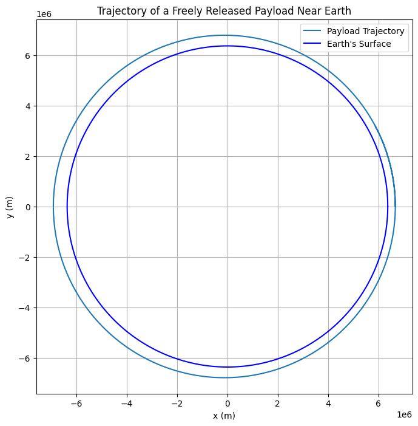

# Problem 3
Below is an example Markdown document with detailed explanations, equations (using LaTeX formatting with dollar signs), and a Python simulation script to analyze and visualize the trajectories of a freely released payload near Earth.

---

# Trajectories of a Freely Released Payload Near Earth

## Motivation

When an object is released from a moving rocket near Earth, its trajectory depends on its initial position, velocity, altitude, and the gravitational pull of the Earth. These trajectories can be:
- **Elliptical:** When the payload remains bound to Earth.
- **Parabolic:** The critical case for escape.
- **Hyperbolic:** When the payload escapes Earth’s gravitational influence.

Understanding these trajectories is crucial for space missions, whether for deploying satellites, planning reentry paths, or executing interplanetary transfers.

## Theoretical Background

### Newton's Law of Gravitation

The gravitational acceleration acting on a payload at a distance $r$ from Earth’s center is given by:

$$
\vec{a} = -\frac{GM}{r^3}\vec{r}
$$

where:
- $G$ is the gravitational constant ($6.67430 \times 10^{-11}\,\mathrm{m^3\,kg^{-1}\,s^{-2}}$),
- $M$ is the mass of the Earth ($5.972 \times 10^{24}\,\mathrm{kg}$),
- $\vec{r}$ is the position vector of the payload relative to Earth’s center, and
- $r = \|\vec{r}\|$ is the distance from Earth’s center.

### Equations of Motion

In a two-dimensional plane (assuming symmetry), we can express the motion with the following ordinary differential equations (ODEs):

$$
\frac{d^2x}{dt^2} = -\frac{GM}{r^3} x,\quad \frac{d^2y}{dt^2} = -\frac{GM}{r^3} y
$$

with $r = \sqrt{x^2 + y^2}$.

### Trajectory Types

- **Elliptical Trajectory:** Occurs when the total specific orbital energy is negative.
- **Parabolic Trajectory:** The borderline case with zero total energy.
- **Hyperbolic Trajectory:** Occurs when the total energy is positive.

The energy per unit mass is:

$$
\epsilon = \frac{v^2}{2} - \frac{GM}{r}
$$

where $v$ is the speed of the payload.

## Numerical Simulation

We can simulate the trajectory of the payload by integrating the above ODEs numerically. In the Python script below, we use the `scipy.integrate.solve_ivp` function to integrate the equations of motion over time.

Below is the Python code:

```python
# Import necessary libraries
import numpy as np
import matplotlib.pyplot as plt
from scipy.integrate import solve_ivp

# Define constants
G = 6.67430e-11        # Gravitational constant in m^3 kg^-1 s^-2
M = 5.972e24           # Mass of Earth in kg
R_earth = 6371e3       # Earth's radius in m

def deriv(t, state):
    """
    Compute the derivative of the state vector.
    state: [x, y, vx, vy]
    """
    x, y, vx, vy = state
    r = np.sqrt(x**2 + y**2)
    ax = -G * M * x / r**3
    ay = -G * M * y / r**3
    return [vx, vy, ax, ay]

# Set initial conditions
# For example, release from an altitude of 300 km above Earth's surface
altitude = 300e3  # 300 km above Earth's surface
x0 = R_earth + altitude
y0 = 0
# Example: initial velocity vector, can be adjusted to simulate different trajectories.
# Here, we simulate a tangential release with speed below escape velocity.
v0 = 7800      # speed in m/s (typical low Earth orbit speed)
vx0 = 0
vy0 = v0

# Create a state vector: [x, y, vx, vy]
initial_state = [x0, y0, vx0, vy0]

# Time span for the simulation: simulate for 6000 seconds (~1.67 hours)
t_span = (0, 6000)
t_eval = np.linspace(t_span[0], t_span[1], 1000)

# Solve the ODE
sol = solve_ivp(deriv, t_span, initial_state, t_eval=t_eval, rtol=1e-8, atol=1e-8)

# Extract the solution
x = sol.y[0]
y = sol.y[1]

# Calculate the distance from Earth's center for plotting Earth
theta = np.linspace(0, 2*np.pi, 500)
earth_x = R_earth * np.cos(theta)
earth_y = R_earth * np.sin(theta)

# Plot the trajectory
plt.figure(figsize=(8, 8))
plt.plot(x, y, label='Payload Trajectory')
plt.plot(earth_x, earth_y, 'b', label="Earth's Surface")
plt.xlabel('x (m)')
plt.ylabel('y (m)')
plt.title('Trajectory of a Freely Released Payload Near Earth')
plt.legend()
plt.axis('equal')
plt.grid(True)
plt.show()
```


## Analysis and Discussion

1. **Trajectory Analysis:**  
   - With the initial conditions above, the payload is given a tangential velocity typical for a low Earth orbit. If you adjust the initial speed or direction, the trajectory can change:
     - **Lower speeds** may result in a suborbital (elliptical) path leading to reentry.
     - **Higher speeds** may transition the orbit from elliptical to parabolic or hyperbolic, resulting in escape from Earth's gravity.

2. **Orbital Insertion vs. Reentry vs. Escape:**  
   - **Orbital Insertion:** To maintain a stable orbit, the payload must reach the first cosmic velocity (orbital velocity).
   - **Reentry:** If the payload’s energy is reduced (e.g., through drag or retroburn), its path can intersect Earth’s atmosphere, leading to reentry.
   - **Escape:** If the payload’s speed reaches or exceeds the second cosmic velocity (escape velocity), it can leave Earth’s gravitational field. The third cosmic velocity would be considered if we extend the analysis to leaving the entire Solar System.

3. **Applications in Space Missions:**  
   - These simulations help in planning satellite deployments, interplanetary missions, and reentry strategies by predicting the payload’s path based on initial conditions.

## Conclusion

This document has defined the key gravitational equations, discussed the types of trajectories (elliptical, parabolic, hyperbolic), and provided a numerical simulation to visualize the motion of a payload released near Earth. The Python script demonstrates how to simulate the payload's trajectory and analyze different scenarios by adjusting the initial conditions.

---

*Feel free to modify the initial conditions and extend the simulation to include additional factors, such as atmospheric drag or multi-body interactions, for a more realistic analysis.*