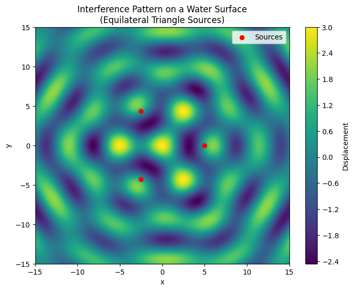

# Problem 1

# Interference Patterns on a Water Surface

## Motivation

Interference occurs when waves from different sources overlap and interact, leading to regions where the waves reinforce one another (constructive interference) or cancel out (destructive interference). On a water surface, such interference can be observed as ripples that form distinct patterns when generated from more than one source. This simple yet visual system helps us understand fundamental wave properties such as amplitude, phase, and the superposition principle.

Studying these patterns deepens our understanding of wave behavior and provides a hands-on approach to learning about real-world phenomena like diffraction, noise cancellation, and other applications in physics and engineering.

## Problem Statement

We analyze the interference patterns formed on a water surface due to waves emanating from point sources placed at the vertices of a regular polygon. For this simulation, we choose an **equilateral triangle**. The basic wave from a point source is described by the equation:

$$
\eta(r, t) = A \cos(kr - \omega t + \phi_0)
$$

where:

- $ \eta(r, t) $ is the displacement at position $r$ and time $t$,
- $ A $ is the amplitude,
- $ k = \frac{2\pi}{\lambda} $ is the wave number (with $\lambda$ as the wavelength),
- $ \omega = 2\pi f $ is the angular frequency (with $f$ as the frequency),
- $ r $ is the distance from the source to the point on the water surface,
- $ \phi_0 $ is the initial phase (assumed the same for all sources in this simulation).

The overall displacement at a point due to all sources is given by the principle of superposition:

$$
\eta_{\text{total}}(x, y, t) = \sum_{i=1}^{n} A \cos\Bigl(k\, r_i(x, y) - \omega t + \phi_0\Bigr)
$$

with $n$ being the number of sources (the vertices of our polygon) and $r_i$ the distance from the $i$-th source.

## Simulation Setup

### Steps:

1. **Select a Regular Polygon:**  
   We choose an equilateral triangle with three vertices.

2. **Position the Sources:**  
   The vertices are positioned symmetrically on the water surface. For example, if the center is at the origin, the vertices can be placed using polar coordinates:
   $$
   (x_i, y_i) = \left( R \cos\theta_i,\; R \sin\theta_i \right)
   $$
   where 
   $$
   \theta_i = \frac{2\pi i}{3} \quad \text{for} \quad i = 0, 1, 2.
   $$

3. **Wave Equations:**  
   For each source, the wave displacement is:
   $$
   \eta_i(x, y, t) = A \cos\Bigl( k\, r_i(x, y) - \omega t + \phi_0 \Bigr)
   $$
   with 
   $$
   r_i(x, y) = \sqrt{(x - x_i)^2 + (y - y_i)^2}.
   $$

4. **Superposition:**  
   The total displacement at each point is the sum of displacements from all sources:
   $$
   \eta_{\text{total}}(x, y, t) = \eta_1(x, y, t) + \eta_2(x, y, t) + \eta_3(x, y, t)
   $$

5. **Visualization:**  
   The resulting displacement pattern is plotted on a grid using contour plots to highlight regions of constructive (high amplitude) and destructive (low amplitude) interference.

Below is a Python script that implements the simulation and visualization.

---

## Python Code

```python
import numpy as np
import matplotlib.pyplot as plt

# Parameters for the wave
A = 1.0                  # Amplitude
wavelength = 5.0         # Wavelength
frequency = 1.0          # Frequency (Hz)
phi0 = 0                 # Initial phase (radians)
k = 2 * np.pi / wavelength  # Wave number
omega = 2 * np.pi * frequency  # Angular frequency

# Time at which to view the interference pattern
t = 0

# Define the grid for the simulation
x = np.linspace(-15, 15, 400)
y = np.linspace(-15, 15, 400)
X, Y = np.meshgrid(x, y)

# Define the positions of the sources (vertices of an equilateral triangle)
R = 5  # Distance from the center to each vertex
angles = np.array([0, 2*np.pi/3, 4*np.pi/3])
sources = [(R * np.cos(theta), R * np.sin(theta)) for theta in angles]

# Calculate the total displacement at each point on the grid
eta_total = np.zeros_like(X)
for (x0, y0) in sources:
    # Distance from current source to each point in the grid
    r = np.sqrt((X - x0)**2 + (Y - y0)**2)
    eta = A * np.cos(k * r - omega * t + phi0)
    eta_total += eta

# Plot the interference pattern
plt.figure(figsize=(8, 6))
contour = plt.contourf(X, Y, eta_total, levels=100, cmap='viridis')
plt.colorbar(contour, label='Displacement')
plt.scatter(*zip(*sources), color='red', marker='o', label='Sources')
plt.title('Interference Pattern on a Water Surface\n(Equilateral Triangle Sources)')
plt.xlabel('x')
plt.ylabel('y')
plt.legend()
plt.show()
```

---



## Explanation of the Code

- **Parameter Setup:**  
  We set the amplitude $A$, wavelength $\lambda$, and frequency $f$ of the waves. The wave number $k$ and angular frequency $\omega$ are computed accordingly.

- **Grid Definition:**  
  A 2D grid is defined using `np.meshgrid` to simulate a section of the water surface.

- **Source Placement:**  
  The three sources are placed at the vertices of an equilateral triangle centered at the origin. Their coordinates are computed using polar coordinates:
  $$
  (x_i, y_i) = \left( R \cos\theta_i,\; R \sin\theta_i \right)
  $$
  where $\theta_i = \frac{2\pi i}{3}$ for $i = 0, 1, 2$.

- **Wave Superposition:**  
  For each source, the distance 
  $$
  r = \sqrt{(x - x_i)^2 + (y - y_i)^2}
  $$
  is computed. The displacement at that point due to the source is calculated and then summed over all sources:
  $$
  \eta_{\text{total}}(x, y, t) = \sum_{i=1}^{3} A \cos\Bigl( k\, r_i(x, y) - \omega t + \phi_0 \Bigr).
  $$

- **Visualization:**  
  A contour plot shows the overall displacement field, where the color gradient represents the amplitude of the displacement. Red dots indicate the source positions.

## Observations

- **Constructive Interference:**  
  Regions where the wave crests from multiple sources meet result in higher amplitude (brighter regions in the plot).

- **Destructive Interference:**  
  Where the wave crest from one source aligns with the trough from another, the amplitudes cancel, resulting in lower displacement values (darker regions).

- **Symmetry:**  
  Given the regular arrangement of sources and identical wave parameters, the interference pattern exhibits symmetry corresponding to the geometry of the equilateral triangle.

