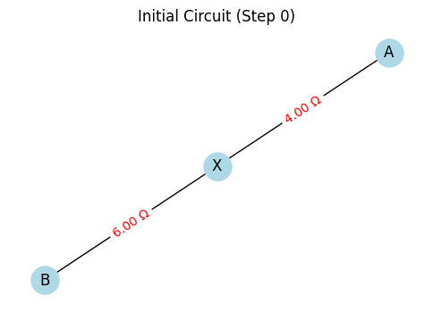
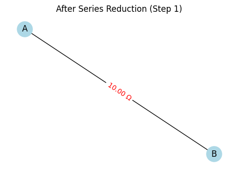
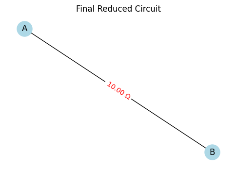
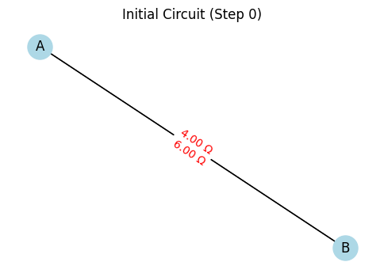
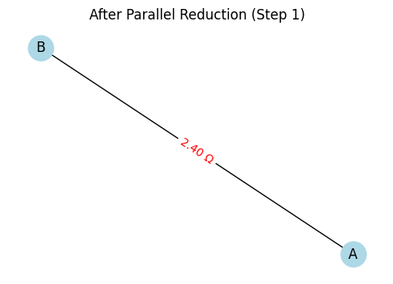
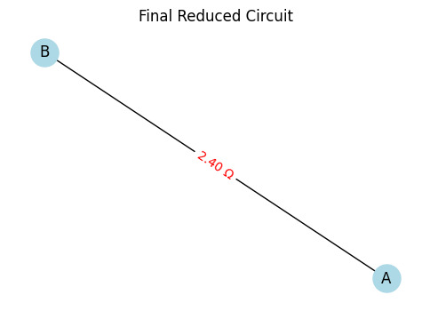
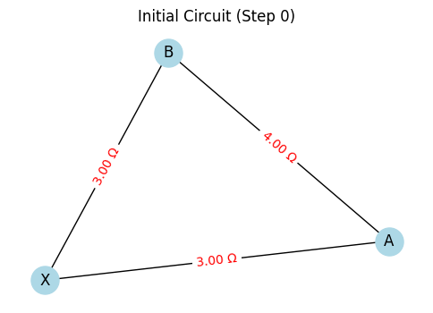
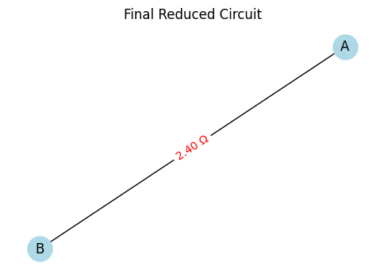

# Problem 1

## Overview

We represent a circuit as a graph where:
- **Nodes** represent junctions.
- **Edges** represent resistors with weights equal to their resistance values.

The goal is to compute the equivalent resistance between two terminal nodes by iteratively reducing the graph using two main reduction rules:

1. **Series Reduction:**  
   If a non-terminal node has degree 2, its two incident resistors (with resistances $R_1$ and $R_2$) are in series and can be replaced by a single resistor with resistance:
   $$
   R_{\text{series}} = R_1 + R_2
   $$

2. **Parallel Reduction:**  
   If two nodes are connected by multiple resistors (with resistances $R_1, R_2, \ldots, R_n$), they are in parallel and can be replaced by a single resistor with equivalent resistance given by:
   $$
   \frac{1}{R_{\text{eq}}} = \sum_{i=1}^{n} \frac{1}{R_i} \quad \text{or} \quad R_{\text{eq}} = \left( \sum_{i=1}^{n} \frac{1}{R_i} \right)^{-1}
   $$

By iteratively applying these reductions, even nested combinations will be simplified, ultimately leaving a single resistor between the two terminal nodes.

---

## Pseudocode

```
Input: Graph G with nodes and edges (each edge has a resistance attribute),
       Terminal nodes: start, end

function compute_equivalent_resistance(G, start, end):
    while (G has more than one edge between start and end):
        
        // Parallel Reduction:
        for each pair of nodes (u, v) in G:
            if there are multiple edges connecting u and v:
                let R_parallel = 1 / (sum(1/R for each edge between u and v))
                remove all edges between u and v
                add a single edge between u and v with resistance R_parallel

        // Series Reduction:
        for each node v in G (excluding start and end):
            if degree(v) == 2:
                Let u and w be the two neighbors of v
                Let R1 = resistance of edge (u, v)
                Let R2 = resistance of edge (v, w)
                Let R_series = R1 + R2
                Remove node v and its incident edges from G

                if an edge already exists between u and w:
                    Let R_existing = resistance of edge (u, w)
                    Replace edge (u, w) with:
                        R_new = 1 / (1/R_existing + 1/R_series)
                else:
                    Add edge (u, w) with weight R_series

        if no series or parallel reduction was performed in this iteration:
            break

    if an edge between start and end exists:
        return the resistance of that edge (i.e. the equivalent resistance)
    else:
        return "Reduction incomplete or non-reducible configuration"
```

**Explanation:**  
- **Series Reduction:** The algorithm checks for nodes (other than the terminal nodes) with exactly two connections. The resistors on these connections are summed, and the node is removed.
- **Parallel Reduction:** For every pair of nodes connected by multiple resistors, the equivalent parallel resistance is computed using:
  $$
  R_{\text{eq}} = \left( \frac{1}{R_1} + \frac{1}{R_2} + \cdots + \frac{1}{R_n} \right)^{-1}
  $$
- **Iterative Process:** Reductions are repeated, which allows the algorithm to handle nested combinations. After each reduction, new series or parallel configurations may emerge, and the process continues until the graph is simplified.

---

## Python Implementation

Below is the full Python implementation using NetworkX:

```python
import networkx as nx

def parallel_reduce(G):
    """Detect and reduce parallel edges in the graph."""
    reduced = False
    # Iterate over all edges and check for multiple edges between the same nodes
    for u, v in list(G.edges()):
        if G.number_of_edges(u, v) > 1:
            # Retrieve all resistance values for edges between u and v
            resistances = [G[u][v][key]['resistance'] for key in list(G[u][v].keys())]
            # Calculate equivalent resistance in parallel: R_eq = 1 / (sum(1/R))
            inv_sum = sum(1.0 / R for R in resistances)
            R_eq = 1.0 / inv_sum
            # Remove all existing parallel edges between u and v
            G.remove_edges_from([(u, v, key) for key in list(G[u][v].keys())])
            # Add one edge with the equivalent resistance
            G.add_edge(u, v, resistance=R_eq)
            reduced = True
    return reduced

def series_reduce(G, terminals):
    """Detect and reduce series connections.
       'terminals' is a set of nodes that should not be removed.
    """
    reduced = False
    nodes_to_check = list(G.nodes())
    for node in nodes_to_check:
        # Skip terminal nodes
        if node in terminals:
            continue
        # For series, the node should have degree 2
        if G.degree(node) == 2:
            # Get the two neighbors of the node
            neighbors = list(G[node])
            if len(neighbors) != 2:
                continue
            u, w = neighbors
            # Assume one edge exists from node to each neighbor after parallel reduction
            R1 = list(G[node][u].values())[0]['resistance']
            R2 = list(G[node][w].values())[0]['resistance']
            # Series equivalent: R_series = R1 + R2
            R_series = R1 + R2

            # Remove the node and its incident edges
            G.remove_node(node)

            # Check if an edge already exists between u and w
            if G.has_edge(u, w):
                existing_resistances = [G[u][w][key]['resistance'] for key in list(G[u][w].keys())]
                # Combine in parallel with existing resistor(s)
                resistors = existing_resistances + [R_series]
                inv_sum = sum(1.0 / R for R in resistors)
                R_new = 1.0 / inv_sum
                G.remove_edges_from([(u, w, key) for key in list(G[u][w].keys())])
                G.add_edge(u, w, resistance=R_new)
            else:
                G.add_edge(u, w, resistance=R_series)
            reduced = True
    return reduced

def compute_equivalent_resistance(G, start, end):
    # Convert to MultiGraph to support parallel edges if not already
    if not isinstance(G, nx.MultiGraph):
        G = nx.MultiGraph(G)
    
    terminals = {start, end}
    changed = True
    while changed:
        changed = False
        # Apply parallel reduction
        if parallel_reduce(G):
            changed = True
        # Apply series reduction
        if series_reduce(G, terminals):
            changed = True

    # If an edge exists between start and end, return its resistance
    if G.has_edge(start, end):
        resistance = list(G[start][end].values())[0]['resistance']
        return resistance
    else:
        return None

# --- Testing the implementation with examples ---

def test_circuit_examples():
    examples = {}

    # Example 1: Simple Series - Two resistors in series between A and B.
    G1 = nx.MultiGraph()
    G1.add_edge('A', 'X', resistance=4)
    G1.add_edge('X', 'B', resistance=6)
    examples['Series (4Ω + 6Ω)'] = (G1, 'A', 'B')

    # Example 2: Simple Parallel - Two resistors in parallel between A and B.
    G2 = nx.MultiGraph()
    G2.add_edge('A', 'B', resistance=4)
    G2.add_edge('A', 'B', resistance=6)
    examples['Parallel (4Ω || 6Ω)'] = (G2, 'A', 'B')

    # Example 3: Nested Combination:
    # A circuit where A-X and X-B are in series, in parallel with a direct A-B resistor.
    G3 = nx.MultiGraph()
    G3.add_edge('A', 'X', resistance=3)
    G3.add_edge('X', 'B', resistance=3)
    G3.add_edge('A', 'B', resistance=4)
    examples['Nested (Series and Parallel)'] = (G3, 'A', 'B')

    # Test each example
    for desc, (G, start, end) in examples.items():
        Req = compute_equivalent_resistance(G, start, end)
        if Req is not None:
            print(f"{desc} => Equivalent Resistance: {Req:.2f} Ω")
        else:
            print(f"{desc} => Could not compute.")

if __name__ == "__main__":
    test_circuit_examples()
```
--- Series (4Ω + 6Ω) ---





Equivalent Resistance: 10.00 Ω

--- Parallel (4Ω || 6Ω) ---





Equivalent Resistance: 2.40 Ω

--- Nested (Series and Parallel) ---





Equivalent Resistance: 2.40 Ω

---

## Explanation of the Implementation

1. **Graph Construction:**  
   We use a `MultiGraph` from NetworkX so that multiple (parallel) edges between the same nodes can be maintained. Each edge carries a resistance value.

2. **Parallel Reduction (`parallel_reduce`):**  
   This function finds node pairs connected by multiple edges and computes their equivalent resistance using:
   $$
   R_{\text{eq}} = \left( \sum_{i=1}^{n} \frac{1}{R_i} \right)^{-1}
   $$
   It then replaces the multiple edges with a single edge.

3. **Series Reduction (`series_reduce`):**  
   The function finds non-terminal nodes with exactly two connections. For a node with resistances $R_1$ and $R_2$, the series equivalent is computed as:
   $$
   R_{\text{series}} = R_1 + R_2
   $$
   The node is removed and its neighbors are reconnected. If an edge already exists, the new resistor is combined in parallel with the existing one.

4. **Iterative Process:**  
   In `compute_equivalent_resistance`, the algorithm repeatedly applies both reductions until no further changes occur, ultimately leaving a single edge between the start and end nodes.

5. **Testing Examples:**  
   - **Example 1:** Two resistors in series.
   - **Example 2:** Two resistors in parallel.
   - **Example 3:** A nested combination where a series pair is in parallel with a direct resistor.

---

## Algorithm Analysis

- **Efficiency:**  
  The algorithm iteratively scans the graph for reducible configurations. For series–parallel reducible networks, it converges quickly. For large or non-reducible networks, the scanning could be less efficient.

- **Potential Improvements:**  
  - **Optimized Data Structures:** Track reducible nodes/edges to minimize repeated scanning.
  - **Advanced Reductions:** Incorporate Y–$\Delta$ (star-delta) transformations or nodal analysis for non-series–parallel networks.
  - **Parallel Processing:** Independent reductions might be parallelized for large networks.

---

This solution demonstrates how graph theory and iterative reduction can be used to compute the equivalent resistance in a circuit, with mathematical expressions formatted using dollar signs for clear presentation.