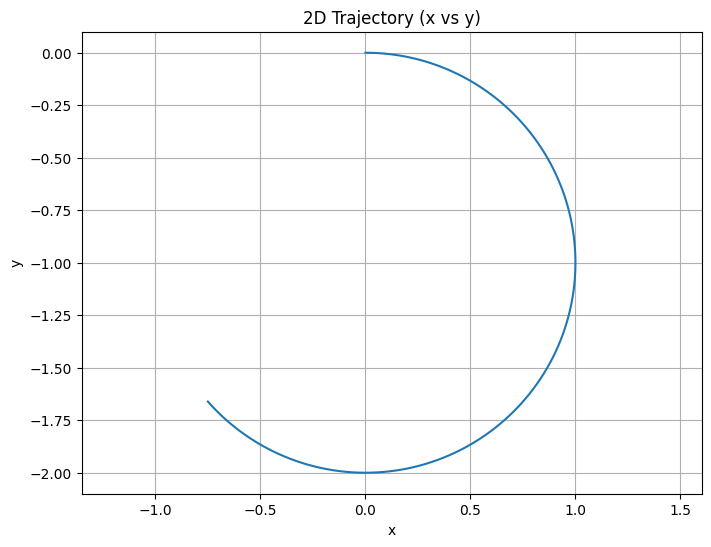
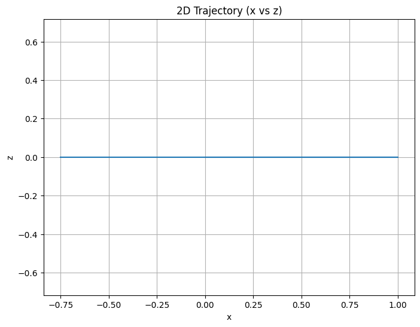
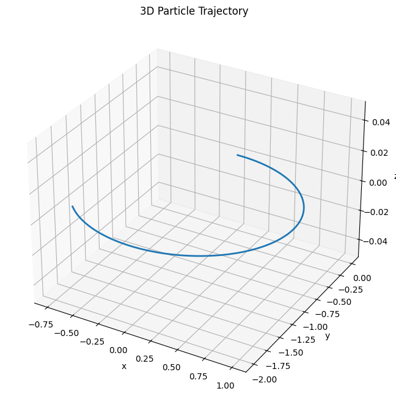

import numpy as np
import matplotlib.pyplot as plt
from mpl_toolkits.mplot3d import Axes3D

\# --- Simulation parameters ---
dt = 0.001               # time step
total_time = 5           # total simulation time
num_steps = int(total_time / dt)

\# Particle properties
q = 1.0                  # charge (Coulombs)
m = 1.0                  # mass (kg)

\# Initial conditions: position and velocity
initial_position = np.array([0.0, 0.0, 0.0])
initial_velocity = np.array([1.0, 0.0, 0.5])  # Can be tuned to see helical motion

\# Field configurations (modify these to explore different scenarios)

\# 1. Uniform magnetic field only (E = 0)
E_field = np.array([0.0, 0.0, 0.0])
B_field = np.array([0.0, 0.0, 1.0])

\# Uncomment one of the following scenarios for combined fields or crossed fields:

\# 2. Combined uniform electric and magnetic fields:
\# E_field = np.array([0.5, 0.0, 0.0])
\# B_field = np.array([0.0, 0.0, 1.0])

\# 3. Crossed electric and magnetic fields (E ⊥ B):
\# E_field = np.array([0.5, 0.0, 0.0])
\# B_field = np.array([0.0, 1.0, 0.0])

def lorentz_acceleration(v, E, B, q, m):
    """
    Compute acceleration from Lorentz force:
    a = (q/m)*(E + v x B)
    """
    return (q/m) * (E + np.cross(v, B))

def rk4_step(position, velocity, dt, E, B, q, m):
    """
    One step of RK4 integration for a charged particle.
    """
    # Define the derivative function
    def derivatives(pos, vel):
        return vel, lorentz_acceleration(vel, E, B, q, m)
    
    # k1 values
    k1_v, k1_a = derivatives(position, velocity)
    
    # k2 values
    k2_v, k2_a = derivatives(position + 0.5 * dt * k1_v,
                             velocity + 0.5 * dt * k1_a)
    
    # k3 values
    k3_v, k3_a = derivatives(position + 0.5 * dt * k2_v,
                             velocity + 0.5 * dt * k2_a)
    
    # k4 values
    k4_v, k4_a = derivatives(position + dt * k3_v,
                             velocity + dt * k3_a)
    
    new_position = position + (dt / 6) * (k1_v + 2 * k2_v + 2 * k3_v + k4_v)
    new_velocity = velocity + (dt / 6) * (k1_a + 2 * k2_a + 2 * k3_a + k4_a)
    
    return new_position, new_velocity

def simulate_motion(initial_position, initial_velocity, dt, num_steps, E, B, q, m):
    """
    Simulate the particle motion over time using RK4 integration.
    Returns arrays of positions and velocities.
    """
    pos = np.array(initial_position, dtype=float)
    vel = np.array(initial_velocity, dtype=float)
    
    positions = np.empty((num_steps, 3))
    velocities = np.empty((num_steps, 3))
    
    for i in range(num_steps):
        positions[i] = pos
        velocities[i] = vel
        pos, vel = rk4_step(pos, vel, dt, E, B, q, m)
    
    return positions, velocities

\# Run the simulation
positions, velocities = simulate_motion(initial_position, initial_velocity,
                                        dt, num_steps, E_field, B_field, q, m)

\# --- Visualization ---

\# 2D Plot: x vs y
plt.figure(figsize=(8, 6))
plt.plot(positions[:, 0], positions[:, 1])
plt.title("2D Trajectory (x vs y)")
plt.xlabel("x")
plt.ylabel("y")
plt.grid(True)
plt.axis("equal")
plt.show()

\# 2D Plot: x vs z
plt.figure(figsize=(8, 6))
plt.plot(positions[:, 0], positions[:, 2])
plt.title("2D Trajectory (x vs z)")
plt.xlabel("x")
plt.ylabel("z")
plt.grid(True)
plt.axis("equal")
plt.show()

\# 3D Plot of the trajectory
fig = plt.figure(figsize=(10, 8))
ax = fig.add_subplot(111, projection='3d')
ax.plot(positions[:, 0], positions[:, 1], positions[:, 2], lw=2)
ax.set_title("3D Particle Trajectory")
ax.set_xlabel("x")
ax.set_ylabel("y")
ax.set_zlabel("z")
plt.show()

