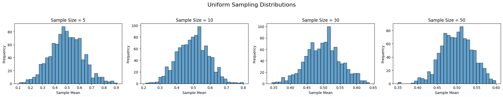
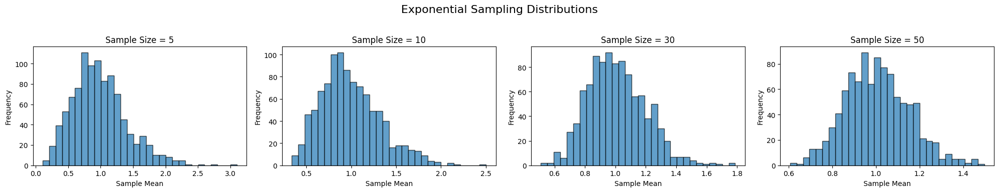
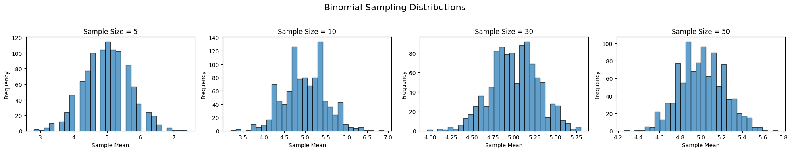

# Problem 1

# Exploring the Central Limit Theorem through Simulations

The Central Limit Theorem (CLT) is a cornerstone of probability and statistics. It states that the sampling distribution of the sample mean approaches a normal distribution as the sample size increases—even when the underlying population distribution is not normal. In this document, we simulate this phenomenon using various types of population distributions.

## 1. Simulating Sampling Distributions

We consider the following population distributions:

- **Uniform distribution**
- **Exponential distribution**
- **Binomial distribution**

For each distribution, we generate a large dataset representing the population. Then, we draw repeated random samples and compute the sample mean to observe how the distribution of the means evolves as the sample size increases.

### Python Code: Generating Population Data

Below are sample code snippets for generating populations:

```python
import numpy as np

# Set a random seed for reproducibility
np.random.seed(42)

# Define the population size
population_size = 100000

# 1. Uniform distribution between 0 and 1
population_uniform = np.random.uniform(0, 1, population_size)

# 2. Exponential distribution with lambda = 1
population_exponential = np.random.exponential(1, population_size)

# 3. Binomial distribution with n=10 and p=0.5
population_binomial = np.random.binomial(10, 0.5, population_size)
```

## 2. Sampling and Visualization

For each distribution, we randomly sample data with various sample sizes (e.g., 5, 10, 30, 50), compute the sample means repeatedly, and then plot histograms of these sample means.

### Python Code: Sampling and Plotting

```python
import matplotlib.pyplot as plt

import numpy as np
import matplotlib.pyplot as plt

# Set a random seed for reproducibility
np.random.seed(42)

# Define the population size
population_size = 100000

# Generate random population data
population_uniform = np.random.uniform(0, 1, population_size)
population_exponential = np.random.exponential(1, population_size)
population_binomial = np.random.binomial(10, 0.5, population_size)

def sample_means(population, sample_size, n_samples=1000):
    means = []
    for _ in range(n_samples):
        sample = np.random.choice(population, size=sample_size, replace=True)
        means.append(np.mean(sample))
    return np.array(means)

def plot_sampling_distribution(population, sample_sizes, title_prefix):
    fig, axes = plt.subplots(1, len(sample_sizes), figsize=(5 * len(sample_sizes), 4))
    for ax, n in zip(axes, sample_sizes):
        means = sample_means(population, sample_size=n, n_samples=1000)
        ax.hist(means, bins=30, edgecolor='black', alpha=0.7)
        ax.set_title(f'Sample Size = {n}')
        ax.set_xlabel('Sample Mean')
        ax.set_ylabel('Frequency')
    fig.suptitle(f'{title_prefix} Sampling Distributions', fontsize=16)
    plt.tight_layout(rect=[0, 0.03, 1, 0.95])
    plt.show()

# Define sample sizes to explore
sample_sizes = [5, 10, 30, 50]

# Plot for Uniform Distribution
plot_sampling_distribution(population_uniform, sample_sizes, 'Uniform')

# Plot for Exponential Distribution
plot_sampling_distribution(population_exponential, sample_sizes, 'Exponential')

# Plot for Binomial Distribution
plot_sampling_distribution(population_binomial, sample_sizes, 'Binomial')


def sample_means(population, sample_size, n_samples=1000):
    means = []
    for _ in range(n_samples):
        sample = np.random.choice(population, size=sample_size, replace=True)
        means.append(np.mean(sample))
    return np.array(means)

def plot_sampling_distribution(population, sample_sizes, title_prefix):
    fig, axes = plt.subplots(1, len(sample_sizes), figsize=(5 * len(sample_sizes), 4))
    for ax, n in zip(axes, sample_sizes):
        means = sample_means(population, sample_size=n, n_samples=1000)
        ax.hist(means, bins=30, edgecolor='black', alpha=0.7)
        ax.set_title(f'Sample Size = {n}')
        ax.set_xlabel('Sample Mean')
        ax.set_ylabel('Frequency')
    fig.suptitle(f'{title_prefix} Sampling Distributions')
    plt.tight_layout(rect=[0, 0.03, 1, 0.95])
    plt.show()

# Define sample sizes to explore
sample_sizes = [5, 10, 30, 50]

# Plot for Uniform Distribution
plot_sampling_distribution(population_uniform, sample_sizes, 'Uniform')

# Plot for Exponential Distribution
plot_sampling_distribution(population_exponential, sample_sizes, 'Exponential')

# Plot for Binomial Distribution
plot_sampling_distribution(population_binomial, sample_sizes, 'Binomial')
```

Each plot shows the histogram of the sample means for a given sample size. As the sample size increases, you'll notice that the histograms become more symmetric and bell-shaped, illustrating the CLT in action.







## 3. Parameter Exploration

### Convergence Rate and Original Distribution Shape

- **Uniform Distribution:** The uniform distribution is already symmetric; even small sample sizes yield sample means that are nearly normal.
- **Exponential Distribution:** This is a skewed distribution, so smaller sample sizes produce skewed sampling distributions. As the sample size increases, the distribution of the sample means converges to normality.
- **Binomial Distribution:** The shape of the binomial distribution depends on its parameters (n and p). In our example (n=10, p=0.5), it is already somewhat symmetric. Larger sample sizes further refine the normality of the sampling distribution.

### Impact of Variance

The variance of the population affects the spread of the sampling distribution. For a given sample size \(n\), the variance of the sample means is equal to the population variance divided by \(n\). In our experiments, you can calculate and compare these theoretical variances with the variance observed from the simulations.

```python
def theoretical_variance(population, sample_size):
    return np.var(population) / sample_size

# Example: Compare variance for the exponential distribution for sample size 30
observed_means = sample_means(population_exponential, sample_size=30, n_samples=1000)
observed_variance = np.var(observed_means)
theoretical_var = theoretical_variance(population_exponential, sample_size=30)

print("Observed Variance (Exponential, sample size 30):", observed_variance)
print("Theoretical Variance (Exponential, sample size 30):", theoretical_var)
```

## 4. Practical Applications

### Estimating Population Parameters

The CLT is crucial in statistical inference. When the sampling distribution of the sample mean is approximately normal, we can use confidence intervals and hypothesis tests to estimate and test population parameters.

### Quality Control in Manufacturing

Manufacturing processes often monitor product quality using sample means. Thanks to the CLT, even if individual measurements are not normally distributed, the distribution of the sample mean is, enabling effective quality control.

### Financial Models

Financial analysts use the CLT to model the behavior of average returns. Since financial returns can be erratic and non-normal, the CLT provides a way to model and predict average behavior over time.

---

## Discussion

Through these simulations, we see that regardless of the population distribution, the sampling distribution of the sample mean tends toward normality as the sample size increases. This convergence is faster for symmetric distributions (like the uniform distribution) and slower for highly skewed distributions (like the exponential distribution). Additionally, the population variance directly influences the spread of the sampling distribution, underlining the theoretical result that the variance of the sample mean is the population variance divided by the sample size.

The CLT is not just a theoretical result; it has practical implications in statistics, engineering, economics, and various fields where making inferences from sample data is necessary.

---

## Deliverables

- **Markdown Document:** This document serves as both a guide and explanation of the simulation of the CLT.
- **Python Scripts/Notebook:** The code provided above can be executed in a Python environment (e.g., Jupyter Notebook) to visualize the sampling distributions.
- **Plots:** Histograms generated from the simulations illustrate the convergence of the sampling distribution to normality as sample sizes increase.
- **Discussion:** The analysis connects the simulation results to theoretical expectations, emphasizing the role of the CLT in practical applications.

This exercise not only demonstrates the CLT but also deepens the understanding of how sample size and population variance affect statistical estimations.

