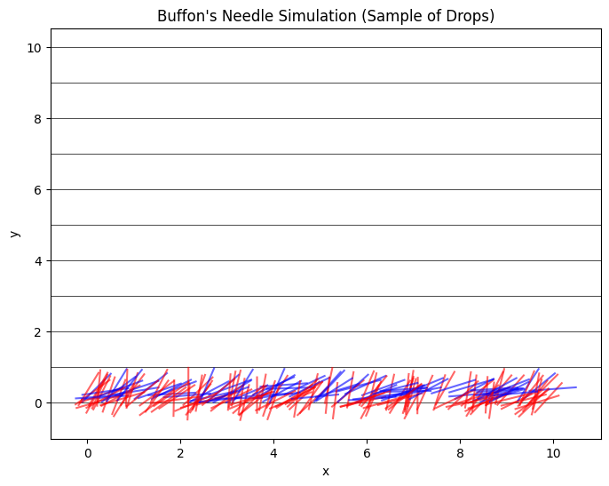
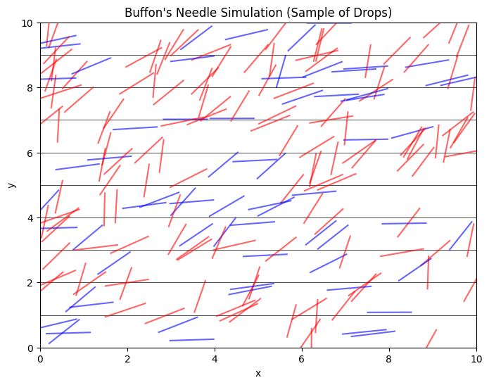

# Problem 2
Below is an example Markdown document that outlines both methods (the circle-based approach and Buffon’s Needle) for estimating π using Monte Carlo simulations. You can save this as a `.md` file and execute the Python code cells in a Jupyter Notebook or Google Colab to see the visualizations and analyses.

---

# Estimating π using Monte Carlo Methods

Monte Carlo simulations harness randomness to solve problems that are analytically challenging. Two classic approaches to estimating π are:

1. **Circle-Based Method:** Uses the ratio of points inside a unit circle to those inside a bounding square.
2. **Buffon’s Needle:** Uses geometric probability by simulating the dropping of a needle on a plane with parallel lines.

Both methods illustrate the convergence of random experiments to a well-known constant and provide insights into the rate of convergence and computational efficiency.

---

## Part 1: Estimating π Using a Circle

### Theoretical Foundation

For a unit circle (radius = 1) inscribed in a square of side length 2, the area of the circle is π and the area of the square is 4. If points are uniformly generated in the square, the ratio of the number of points that fall inside the circle to the total points approximates the ratio of their areas:

\[
\frac{\text{Points in circle}}{\text{Total points}} \approx \frac{\pi}{4}
\]

Thus, we can estimate π as:

\[
\pi \approx 4 \times \frac{\text{Points in circle}}{\text{Total points}}
\]

### Simulation & Visualization Code

```python
import numpy as np
import matplotlib.pyplot as plt

def estimate_pi_circle(n_points):
    # Generate random points in the square [-1, 1] x [-1, 1]
    x = np.random.uniform(-1, 1, n_points)
    y = np.random.uniform(-1, 1, n_points)
    
    # Determine if the points are inside the unit circle
    inside = x**2 + y**2 <= 1
    pi_estimate = 4 * np.sum(inside) / n_points
    return pi_estimate, x, y, inside

# Number of points for the simulation
n_points = 10000
pi_est, x, y, inside = estimate_pi_circle(n_points)
print("Estimated π (Circle Method):", pi_est)

# Plotting the results
plt.figure(figsize=(6,6))
plt.scatter(x[inside], y[inside], color='blue', s=1, label='Inside Circle')
plt.scatter(x[~inside], y[~inside], color='red', s=1, label='Outside Circle')
plt.title('Monte Carlo Simulation for π using a Circle')
plt.xlabel('x')
plt.ylabel('y')
plt.legend()
plt.show()
```

### Analysis

- **Convergence:** As you increase `n_points`, the estimate of π becomes more accurate. Try using 10,000, 50,000, or 100,000 points to observe the convergence.
- **Visualization:** The plot visually distinguishes points that fall inside the circle (blue) versus outside (red), reinforcing the geometric probability concept.

---

## Part 2: Estimating π Using Buffon’s Needle

### Theoretical Foundation

Buffon’s Needle problem involves dropping a needle of length \(L\) onto a plane with parallel lines spaced a distance \(d\) apart. When \(L \leq d\), the probability \(P\) that the needle will cross a line is given by:

\[
P = \frac{2L}{\pi d}
\]

Rearranging gives an estimate for π:

\[
\pi \approx \frac{2L \cdot n}{d \cdot k}
\]

where:
- \(n\) is the total number of needle drops,
- \(k\) is the number of times the needle crosses a line.

For simplicity, let’s assume \(L = 1\) and \(d = 1\).

### Simulation & Visualization Code

```python
import numpy as np
import matplotlib.pyplot as plt

def buffon_needle(n_drops, needle_length=1, line_distance=1):
    hits = 0
    needles = []  # To store needle positions for visualization
    for _ in range(n_drops):
        # Random position for the needle center along vertical axis between 0 and line_distance/2
        center = np.random.uniform(0, line_distance/2)
        # Random angle between 0 and pi/2 (needle can be mirrored, so only need a quadrant)
        theta = np.random.uniform(0, np.pi/2)
        # Calculate the vertical distance from the center to one end of the needle
        projection = (needle_length / 2) * np.sin(theta)
        # Needle crosses a line if the projection is greater than the distance from the center to the nearest line
        if projection >= center:
            hits += 1
        # Save the needle for plotting: determine the end points
        x_center = np.random.uniform(0, 10)  # Arbitrary horizontal position for visualization
        y_center = center  # Use the generated center for vertical position
        dx = (needle_length / 2) * np.cos(theta)
        dy = (needle_length / 2) * np.sin(theta)
        needle = ((x_center - dx, y_center - dy), (x_center + dx, y_center + dy))
        needles.append((needle, theta, center))
    pi_estimate = (2 * needle_length * n_drops) / (line_distance * hits) if hits else None
    return pi_estimate, needles, hits

# Number of needle drops for the simulation
n_drops = 10000
pi_est_buffon, needles, hits = buffon_needle(n_drops)
print("Estimated π (Buffon’s Needle):", pi_est_buffon)

# Visualization: Plot a subset of needle drops with the parallel lines
plt.figure(figsize=(8,6))
# Plot parallel lines (for simplicity, we plot lines at y = 0, 1, 2, ... up to 10)
for y in np.arange(0, 11, 1):
    plt.axhline(y, color='black', linewidth=0.5)
    
# Plot a subset of needles for clarity (e.g., 200 needles)
for needle, theta, center in needles[:200]:
    (x0, y0), (x1, y1) = needle
    # Color needles red if they cross a line, blue otherwise
    if (needle_length / 2) * np.sin(theta) >= center:
        color = 'red'
    else:
        color = 'blue'
    plt.plot([x0, x1], [y0, y1], color=color, alpha=0.6)
plt.title("Buffon's Needle Simulation (Sample of Drops)")
plt.xlabel('x')
plt.ylabel('y')
plt.show()
```



# Explanation for Picture 2:

Needle Center Distribution:

Instead of confining the needle center (y_center) to between 0 and line_distance/2, we now sample it uniformly between 0 and 10 (using the vertical_range parameter).

Determining Distance to the Nearest Line:
For any given y_center, the code computes the distance to the nearest horizontal line (spaced by line_distance) using modulo arithmetic.

Visualization:
The plot now draws parallel lines at every integer y-value (0, 1, 2, ..., 10) and displays needles across the entire vertical range. Needles that cross a line are drawn in red, while those that do not are in blue.



### Analysis

- **Convergence:** Increasing the number of needle drops (\(n\)) improves the accuracy of the π estimate. In the simulation above, try increasing `n_drops` to observe changes.
- **Visualization:** The plot shows parallel lines and a subset of needle drops. Needles that cross a line are colored red; those that do not are blue. This visual distinction helps in understanding the geometric basis of the probability calculation.
- **Computational Considerations:** Although Buffon’s Needle can be slower to converge compared to the circle method, it offers an interesting alternative perspective on randomness and geometric probability.

---

## Final Discussion

Both methods rely on generating a large number of random events and using the proportion of “successful” events to estimate π:

- The **circle-based method** directly relates areas (circle vs. square) and is generally easier to implement and faster to converge.
- **Buffon’s Needle** provides an elegant historical problem that connects probability with geometry. Its convergence is slower, but it offers deep insights into stochastic modeling.

These simulations underscore the power of Monte Carlo methods in numerical estimation and serve as a gateway to more advanced topics in probability, statistics, and computational science.

---

Feel free to modify and extend the code to explore different parameters (e.g., different needle lengths, line spacings, or even more complex geometries) to further analyze convergence rates and computational efficiency.