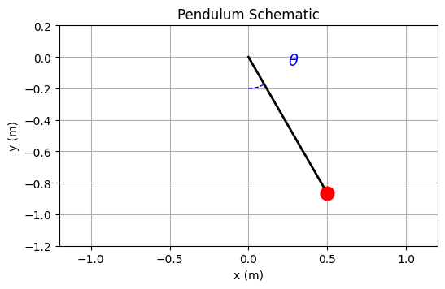
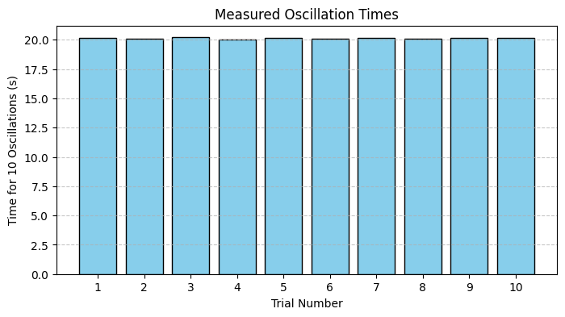

Below is an integrated Markdown document that includes both the explanation, calculations, and the Python code blocks for generating the schematic of a pendulum and a bar chart of the measured oscillation times.

---

# Measuring Earth's Gravitational Acceleration with a Pendulum

The acceleration due to gravity, $g$, is a fundamental constant influencing many physical phenomena. One classic method to determine $g$ is by measuring the period of a simple pendulum. This experiment illustrates not only the method of measurement but also emphasizes rigorous uncertainty analysis.

---

## 1. Materials and Setup

### Materials:
- A string (e.g., 1 or 1.5 meters long)
- A small weight (e.g., a bag of coins, a key chain)
- Stopwatch (or smartphone timer)
- Ruler or measuring tape

### Setup:
1. **Pendulum Construction:**  
   - Attach the weight to the string.
   - Fix the other end of the string to a sturdy support.
2. **Length Measurement:**  
   - Measure the length $L$ of the pendulum from the suspension point to the center of mass of the weight.
   - Record the resolution of your measuring tool. For example, if the ruler has a resolution of 1 mm, the uncertainty in $L$ is estimated as:
     
     $$
     \Delta L = \frac{1 \text{ mm}}{2} = 0.5 \text{ mm}
     $$

---

## 2. Data Collection

1. **Oscillation Measurement:**  
   - Displace the pendulum by less than $15^\circ$ and release it.
   - Measure the time for 10 complete oscillations ($T_{10}$). Repeat this process 10 times.
   - Record all 10 measurements.

2. **Calculating the Mean and Uncertainty:**  
   - Let the 10 measurements for 10 oscillations be:  
     $$
     T_{10,1}, T_{10,2}, \dots, T_{10,10}
     $$
   - The mean time for 10 oscillations is:
     
     $$
     \bar{T}_{10} = \frac{1}{10} \sum_{i=1}^{10} T_{10,i}
     $$
     
   - Compute the standard deviation $\sigma_{T_{10}}$ of these measurements.
   - The uncertainty in the mean time is:
     
     $$
     \Delta \bar{T}_{10} = \frac{\sigma_{T_{10}}}{\sqrt{10}}
     $$

3. **Determine the Period $T$ of One Oscillation:**

   $$
   T = \frac{\bar{T}_{10}}{10} \quad \text{with uncertainty} \quad \Delta T = \frac{\Delta \bar{T}_{10}}{10}
   $$

---

## 3. Calculations

### 3.1 Estimating $g$

The period of a simple pendulum (for small oscillations) is given by:

$$
T = 2\pi \sqrt{\frac{L}{g}}
$$

Solving for $g$:

$$
g = \frac{4\pi^2 L}{T^2}
$$

### 3.2 Uncertainty Propagation

If $g$ is calculated using $L$ and $T$ with uncertainties $\Delta L$ and $\Delta T$, respectively, then the relative uncertainty in $g$ is given by:

$$
\frac{\Delta g}{g} = \sqrt{\left(\frac{\Delta L}{L}\right)^2 + \left(2\frac{\Delta T}{T}\right)^2}
$$

Thus, the absolute uncertainty in $g$ is:

$$
\Delta g = g \times \sqrt{\left(\frac{\Delta L}{L}\right)^2 + \left(2\frac{\Delta T}{T}\right)^2}
$$

### 3.3 Example Data

Suppose you recorded the following times for 10 oscillations:

| Trial | \(T_{10}\) (s) |
|:-----:|:--------------:|
| 1     | 20.15          |
| 2     | 20.10          |
| 3     | 20.20          |
| 4     | 20.05          |
| 5     | 20.18          |
| 6     | 20.12          |
| 7     | 20.16          |
| 8     | 20.11          |
| 9     | 20.14          |
| 10    | 20.17          |

Assume:
- $L = 1.000 \, \text{m}$ with $\Delta L = 0.0005 \, \text{m}$.
- Mean time for 10 oscillations: $\bar{T}_{10} \approx 20.14 \, \text{s}$  
  $\Rightarrow$ Period for one oscillation: $T \approx 2.014 \, \text{s}$
- Suppose $\sigma_{T_{10}} \approx 0.05 \, \text{s}$ so that:
  
  $
  \Delta \bar{T}_{10} \approx \frac{0.05}{\sqrt{10}} \approx 0.0158 \, \text{s} \quad \text{and} \quad \Delta T \approx \frac{0.0158}{10} = 0.00158 \, \text{s}
  $

Then:

$
g \approx \frac{4\pi^2 \times 1.000}{(2.014)^2} \approx \frac{39.478}{4.056} \approx 9.74 \, \text{m/s}^2
$

And the relative uncertainties:

$
\frac{\Delta L}{L} \approx 0.0005, \quad \frac{\Delta T}{T} \approx \frac{0.00158}{2.014} \approx 0.000785
$

$
\frac{\Delta g}{g} = \sqrt{(0.0005)^2 + \left(2 \times 0.000785\right)^2} \approx 0.00149
$

$
\Delta g \approx 9.74 \times 0.00149 \approx 0.0145 \, \text{m/s}^2
$

Thus, the measured value of $g$ is:

$
g = 9.74 \pm 0.015 \, \text{m/s}^2
$

---

## 4. Visuals

### 4.1 Pendulum Schematic

The following code produces a schematic diagram of a pendulum:

```python
import matplotlib.pyplot as plt
import numpy as np

# Pendulum parameters
L = 1.0  # pendulum length in meters
theta = np.pi/6  # 30 degrees angle

# Calculate pendulum bob position (x, y)
x = L * np.sin(theta)
y = -L * np.cos(theta)

# Create the schematic plot
plt.figure(figsize=(6,6))
plt.plot([0, x], [0, y], 'k-', lw=2)  # pendulum string
plt.plot(x, y, 'ro', markersize=12)    # pendulum bob

# Draw an arc to represent the angle theta
arc_theta = np.linspace(0, theta, 100)
arc_x = 0.2 * np.sin(arc_theta)
arc_y = -0.2 * np.cos(arc_theta)
plt.plot(arc_x, arc_y, 'b--', lw=1)

plt.text(0.25, -0.05, r'$\theta$', color='blue', fontsize=14)
plt.title("Pendulum Schematic")
plt.xlabel("x (m)")
plt.ylabel("y (m)")
plt.xlim(-1.2*L, 1.2*L)
plt.ylim(-1.2*L, 0.2*L)
plt.gca().set_aspect('equal', adjustable='box')
plt.grid(True)
plt.show()
```




### 4.2 Visualizing Measured Oscillation Times

This code generates a bar chart to visualize the recorded times for 10 oscillations across 10 trials:

```python
import matplotlib.pyplot as plt
import numpy as np

# Example data for 10 measurements (time for 10 oscillations in seconds)
trials = np.arange(1, 11)
T10_measurements = [20.15, 20.10, 20.20, 20.05, 20.18, 20.12, 20.16, 20.11, 20.14, 20.17]

plt.figure(figsize=(8, 4))
plt.bar(trials, T10_measurements, color='skyblue', edgecolor='black')
plt.xlabel("Trial Number")
plt.ylabel("Time for 10 Oscillations (s)")
plt.title("Measured Oscillation Times")
plt.xticks(trials)
plt.grid(axis='y', linestyle='--', alpha=0.7)
plt.show()
```


---

## 5. Analysis and Discussion

### Comparison to the Standard Value
- **Standard Value:** $g \approx 9.81 \, \text{m/s}^2$
- **Measured Value:** $g \approx 9.74 \, \text{m/s}^2$ (from our example data)
- The slight discrepancy can be attributed to measurement uncertainties or local variations in $g$.

### Sources of Uncertainty and Their Impact
1. **Measurement Resolution:**  
   - The uncertainty in $L$ (half the smallest division of the ruler) contributes to the overall uncertainty.
2. **Timing Variability:**  
   - Human reaction time and potential stopwatch errors introduce variability in $T_{10}$. Repeated measurements and calculating the standard deviation help quantify this uncertainty.
3. **Assumptions:**  
   - The pendulum period formula $T = 2\pi\sqrt{L/g}$ assumes small oscillation angles (typically $<15^\circ$). Deviations from this condition introduce systematic errors.
4. **Experimental Limitations:**  
   - Air resistance, friction at the pivot, and alignment errors may also affect the measurements.

---

## Deliverables

1. **Tabulated Data:**  
   - A table of 10 measurements for the time of 10 oscillations.
   - Calculated values for the mean time $\bar{T}_{10}$, period $T$, and their uncertainties.
2. **Calculated $g$ and Its Uncertainty:**  
   - The value of $g$ along with the uncertainty propagated from the measurements.
3. **Visualizations:**  
   - A schematic diagram of the pendulum.
   - A bar chart of the measured oscillation times.
4. **Discussion:**  
   - A detailed discussion on the sources of uncertainty and their impact on the final measurement of $g$.

---

This integrated document combines theoretical background, experimental data, uncertainty analysis, and visualizations, providing a complete report on measuring Earth's gravitational acceleration with a pendulum.

